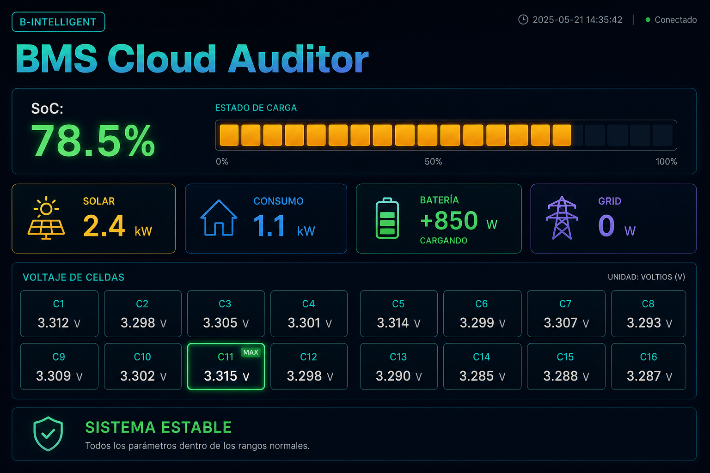

# Solar Telemetry — Victron / JK BMS

Monitor de **planta solar y salud de baterías LiFePO4** (Victron GX + JK BMS).

[](https://juanki58.github.io/solar-telemetry/)

**[▶ Abrir monitor (demo en GitHub Pages)](https://juanki58.github.io/solar-telemetry/)** — vista previa pública con datos simulados (como en otros repos). El dashboard real (planta / Modbus) se ejecuta en local con Streamlit.

| Servicio | URL |
|----------|-----|
| **Demo pública (Pages)** | https://juanki58.github.io/solar-telemetry/ |
| **Monitor real (local)** | `http://127.0.0.1:8501` |

## Arranque (monitor real)

```powershell
cd C:\Users\juanc\projects\solar-telemetry
copy config.example.json config.json
# Edita victron_host / jk_host_* en config.json
python -m pip install -r requirements.txt
python -m streamlit run bms_web_monitor.py
```

Modo laboratorio sin planta: en `config.json` pon `"default_mode": "sim"`.

## Scripts

| Archivo | Uso |
|---------|-----|
| `bms_web_monitor.py` | Dashboard Streamlit (SoC, celdas JK, salud LiFePO4) |
| `bms_gui_monitor.py` | Panel escritorio tkinter |
| `victron_industrial_bms_safety.py` | Protección activa Modbus Victron |
| `jk_bms_client.py` | Cliente JK BMS v19 |
| `config_loader.py` | Carga `config.json` |
| `integrations/whatsapp_alerts.py` | Alertas opcionales WhatsApp Cloud API |
| `docs/index.html` | Demo estática publicada en GitHub Pages |

## Config

- Plantilla: `config.example.json`
- Local (no se sube): `config.json` — IPs de Cerbo/JK, umbrales, WhatsApp

## Seguridad activa Victron

```powershell
python victron_industrial_bms_safety.py
```

## Licencia

Uso personal / planta propia salvo que se indique lo contrario.
