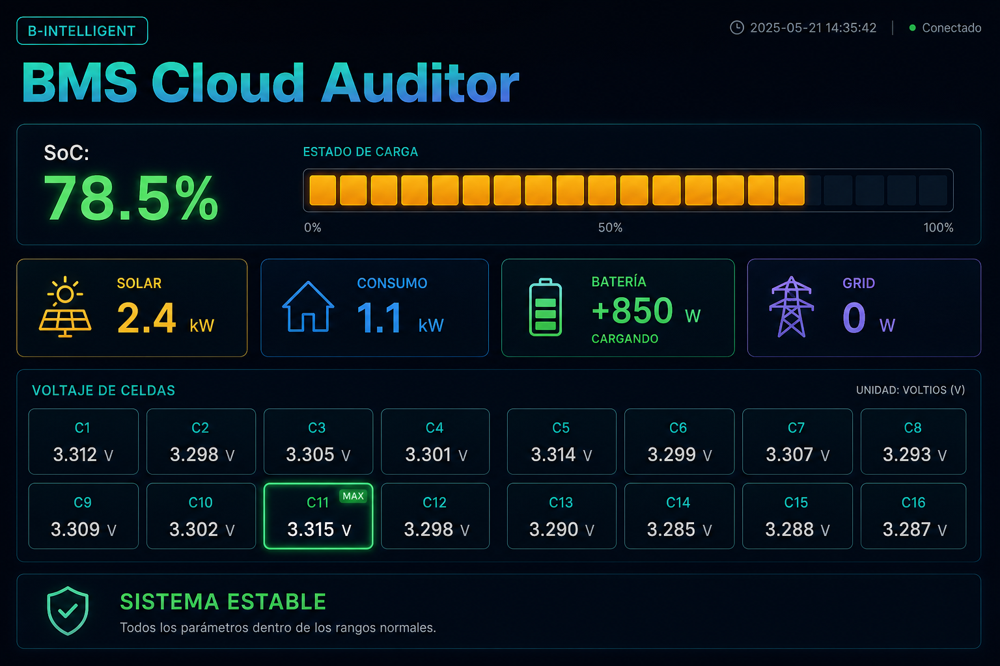

# Solar Telemetry — Victron / JK BMS

Monitor profesional de **planta solar y salud de baterías LiFePO4** (Victron GX + JK BMS).

[](https://htmlpreview.github.io/?https://github.com/Juanki58/solar-telemetry/blob/main/docs/index.html)

**[▶ Demo pública (simulada)](https://htmlpreview.github.io/?https://github.com/Juanki58/solar-telemetry/blob/main/docs/index.html)** — vista previa en el navegador, sin planta.  
El monitor real (Modbus / JK) se instala en Windows en 2 clics.

> **⚠️ Seguridad:** esto **no es un BMS certificado**. Los cortes activos Modbus son **experimentales** y van en **dry-run por defecto**. Lee [`docs/SAFETY_DISCLAIMER.md`](docs/SAFETY_DISCLAIMER.md) antes de conectar a una planta real.

| Qué | Dónde |
|-----|--------|
| Demo HTML | [htmlpreview](https://htmlpreview.github.io/?https://github.com/Juanki58/solar-telemetry/blob/main/docs/index.html) |
| App local (PC) | `http://127.0.0.1:8501` tras instalar |
| App Android | Carpeta [`android/`](android/) — WebView hacia el PC en LAN |
| Aviso de seguridad | [`docs/SAFETY_DISCLAIMER.md`](docs/SAFETY_DISCLAIMER.md) |
| Licencia | [`LICENSE`](LICENSE) (MIT) |

---

## Instalación en Windows (recomendado)

**Requisito:** [Python **3.11 o 3.12**](https://www.python.org/downloads/) (recomendado) con *Add python.exe to PATH*.  
Evita usar solo Python 3.13/3.14: Streamlit en Windows suele fallar. El instalador busca solo 3.10–3.12.

1. Descarga o clona este repo.
2. Doble clic en:

```text
scripts\windows\Install-BIntelligent.bat
```

O en PowerShell (modo laboratorio sin planta):

```powershell
cd C:\ruta\a\solar-telemetry
powershell -ExecutionPolicy Bypass -File .\scripts\windows\Install-BIntelligent.ps1 -SimMode
```

Eso crea `.venv`, instala dependencias, genera `config.json` y deja el acceso directo **B-Intelligent Monitor** en el **Escritorio** y en el **menú Inicio**, con icono `assets\b-intelligent.ico`.

3. Arrancar: doble clic en **B-Intelligent Monitor**, o:

```text
scripts\windows\Start-BIntelligent.bat
```

Si falta `.venv`, **Start** lanza la instalación automáticamente.  
Si falta el acceso directo, **Start** lo recrea.  
Se abre el navegador en `http://127.0.0.1:8501`.

### Acceso directo de escritorio

| Acción | Resultado |
|--------|-----------|
| `Install-BIntelligent.bat` | Crea/recrea **B-Intelligent Monitor** (Escritorio + Inicio) → `Start-BIntelligent.bat` |
| Solo recrear iconos | `powershell -ExecutionPolicy Bypass -File .\scripts\windows\Create-Shortcuts.ps1` |
| Icono | `assets\b-intelligent.ico` |

### Desinstalar accesos directos

```powershell
powershell -ExecutionPolicy Bypass -File .\scripts\windows\Uninstall-BIntelligent.ps1
# Opcional: -RemoveVenv  -RemoveConfig
```

---

## App Android (WebView)

El monitor real corre en el **PC**. La app Android es un cliente WebView que abre esa URL en la misma Wi‑Fi (no se publica en Play Store desde este repo).

### Compilar e instalar el APK

1. Instala [Android Studio](https://developer.android.com/studio).
2. Abre la carpeta `android/` (**Open**).
3. **Build → Build Bundle(s) / APK(s) → Build APK(s)**.
4. Instala en el teléfono:

```text
android/app/build/outputs/apk/debug/app-debug.apk
```

Detalle completo: [`android/README.md`](android/README.md).

### Apuntar el móvil al monitor del PC

1. **Obligatorio:** configura una contraseña antes del modo LAN:

```json
"web_auth_password": "tu-clave-segura"
```

en `config.json`, **o** copia `.streamlit/secrets.toml.example` → `.streamlit/secrets.toml`.

2. En el PC, arranca en modo LAN:

```text
scripts\windows\Start-BIntelligent-LAN.bat
```

(o `python launcher.py --host 0.0.0.0 --port 8501`)

Sin password, el launcher **bloquea** el arranque LAN (fail-closed). No uses `--allow-insecure-lan` fuera de un lab aislado.

3. Permite el puerto **TCP 8501** en el firewall de Windows (red privada).
4. Obtén la IP del PC (`ipconfig`, p. ej. `192.168.1.40`).
5. En la app: menú → **Configurar servidor** → `http://192.168.1.40:8501`.

PC y móvil deben compartir la misma Wi‑Fi. La primera ejecución pide la URL; también hay opción de abrir la **demo pública** sin planta.

---

## Arranque manual (cualquier SO)

```powershell
cd C:\ruta\a\solar-telemetry
python -m venv .venv
.\.venv\Scripts\Activate.ps1          # Linux/mac: source .venv/bin/activate
python -m pip install -r requirements.txt
copy config.example.json config.json  # primera vez
python launcher.py
```

Opciones del launcher:

```text
python launcher.py --host 0.0.0.0 --port 8501   # LAN — requiere web_auth_password
python launcher.py --no-browser
python launcher.py --allow-insecure-lan         # solo laboratorio (NO recomendado)
```

Modo laboratorio sin Victron/JK: en `config.json` pon `"default_mode": "sim"`.  
El dashboard muestra un **banner muy visible** cuando los datos son simulados o hay error de conexión — no se presentan como planta en vivo.

### Smoke test

```powershell
.\.venv\Scripts\python.exe scripts\smoke_test.py
```

---

## Componentes

| Archivo | Uso |
|---------|-----|
| `launcher.py` | Arranque tipo app (Streamlit + navegador); fail-closed en LAN sin auth |
| `bms_web_monitor.py` | Dashboard Streamlit (SoC, celdas JK, salud LiFePO4) |
| `bms_gui_monitor.py` | Panel escritorio tkinter (alternativa ligera) |
| `victron_industrial_bms_safety.py` | Protección activa Modbus Victron (**dry-run por defecto**) |
| `jk_bms_client.py` | Cliente JK BMS v19 |
| `config_loader.py` | Carga `config.json` |
| `integrations/whatsapp_alerts.py` | Alertas opcionales WhatsApp Cloud API |
| `docs/index.html` | Demo estática (simulada) + PWA manifest |
| `docs/SAFETY_DISCLAIMER.md` | Aviso de seguridad / no-BMS-certificado |
| `scripts/smoke_test.py` | Smoke test de imports + dry-run safety |
| `scripts/windows/*` | Instalación, arranque y accesos directos Windows |
| `android/` | App WebView Kotlin/Gradle (cliente LAN) |
| `assets/b-intelligent.ico` | Icono del acceso directo Windows |

## Config

- Plantilla: `config.example.json`
- Local (no se sube): `config.json` — IPs Cerbo/JK, umbrales, WhatsApp, auth
- Claves relevantes de seguridad comercial:

| Clave | Default | Significado |
|-------|---------|-------------|
| `battery_source` | `jk_tcp` | Origen de datos de batería: `jk_tcp` (Modbus TCP del JK) o `victron` / `gx_can` (pack vía GX) |
| `safety_write_enabled` | `false` | Si `true`, el supervisor puede escribir registros Victron (experimental) |
| `web_auth_password` | `""` | Password del monitor Streamlit (obligatorio en LAN) |
| `web_auth_required_on_lan` | `true` | Bloquea UI si bind `0.0.0.0` sin password |

### JK BMS en CAN al Color Control / Cerbo (DVCC)

Si los JK **no** tienen IP propia en LAN y van por **cable CAN** al Color Control GX:

- Pon `"battery_source": "victron"` (alias: `"gx_can"`).
- **No** uses `jk_host` / TCP `6481`: esos timeouts son esperados (no hay servicio Modbus en `.34`/`.35`).
- El monitor lee del GX (p. ej. `192.168.1.37`) SoC, voltaje de pack, corriente, potencia y temp si el unit de batería está configurado.
- **Celdas individuales (C1…C16) no están disponibles** por Modbus estándar del servicio de batería agregado. La UI lo indica con honestidad (`jk_online` permanece `false`).
- Para celdas celda-a-celda hace falta un JK con Modbus TCP en red (`battery_source: "jk_tcp"`).

Preferible guardar la password en `.streamlit/secrets.toml` (no en git).

## Seguridad activa Victron

```powershell
.\.venv\Scripts\python.exe victron_industrial_bms_safety.py --once --dry-run
```

- Por defecto: **DRY-RUN** (solo log). Habilitar escrituras: `"safety_write_enabled": true` **bajo tu responsabilidad**.
- **Nunca escribe** si la telemetría es simulada, fallback o JK offline.
- **No sustituye** un BMS hardware certificado. Ver [`docs/SAFETY_DISCLAIMER.md`](docs/SAFETY_DISCLAIMER.md).

## Camino comercial (alcance actual)

Este repo apunta a uso en **planta propia / laboratorio** con honestidad de datos y fail-closed en LAN.  
**No** incluye en este paso: SaaS multi-tenant, publicación Play Store ni MSI firmado con code-signing.

## Licencia

[MIT](LICENSE) — ver también el aviso de seguridad vinculante en `LICENSE` y `docs/SAFETY_DISCLAIMER.md`.
